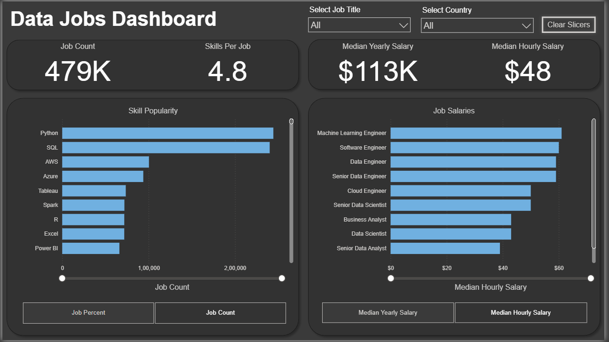
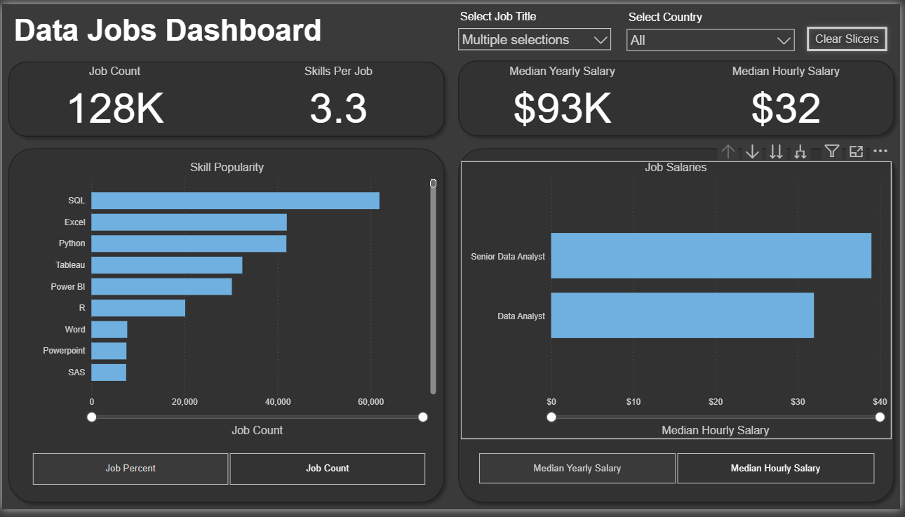
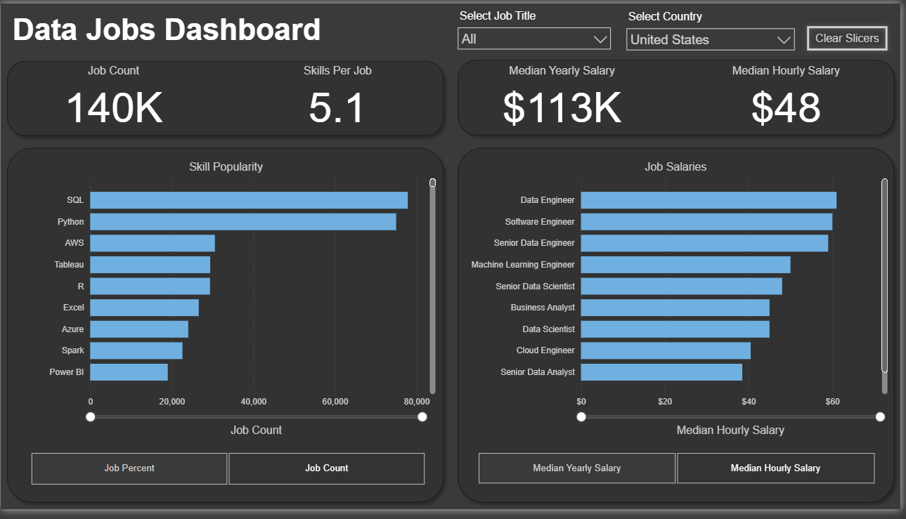
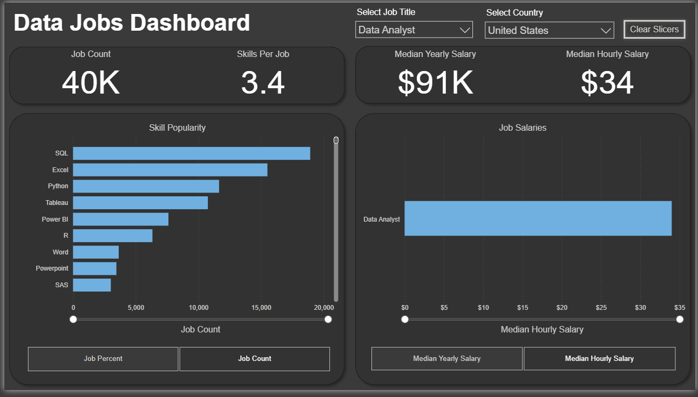
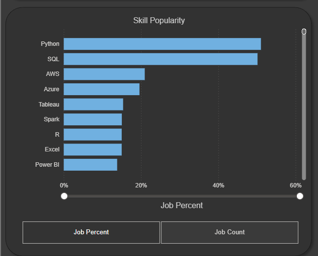
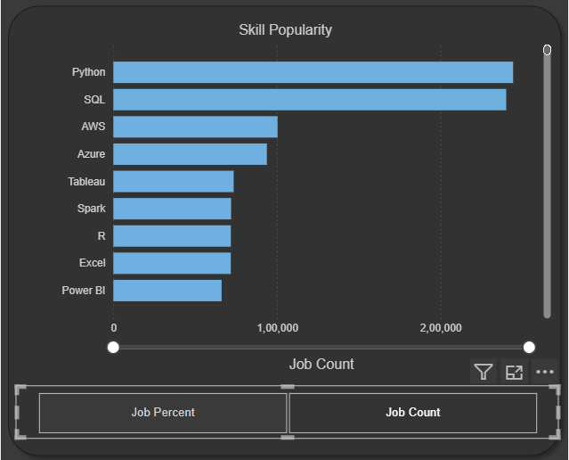
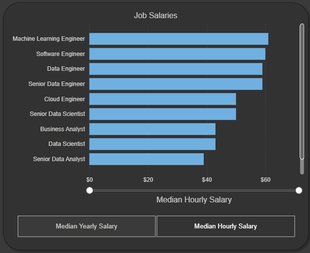
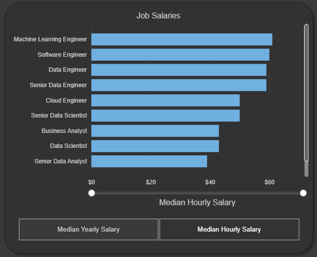

# 📊 Data Jobs Dashboard  — Power BI

An interactive **Power BI dashboard analyzing technology-sector job postings worldwide in 2023**.  
The dashboard helps users explore job-market demand, skills, and salary trends across different job titles and countries.

Data Jobs Dashboard Overview

---

## 🔎 Project Overview

The technology job market is constantly changing, with differences in demand, required skills, and compensation across roles and countries.

**Data Jobs Dashboard** transforms a large job-posting dataset into an interactive dashboard that makes these trends easier to explore.

The dashboard focuses on:

- 🌍 Job trends across countries
- 💼 Demand across different technology job titles
- 🧠 Popular skills required by employers
- 💰 Median yearly and hourly salaries
- 📈 Comparison of job demand across skills
- 🔍 Interactive filtering by job title and country

> **Dataset period:** 2023  
> **Geographic scope:** Worldwide  
> **Tool:** Microsoft Power BI

---

## 🎯 Objectives

The main objectives of this project were to:

1. Analyze how technology jobs were distributed globally in 2023.
2. Identify the most in-demand technical skills.
3. Compare compensation across different technology job roles.
4. Explore how job-market trends change when filtering by job title or country.
5. Build an interactive dashboard that allows users to investigate the data themselves.

---

## 📊 Dashboard Overview

The main dashboard provides a single-page overview of the global technology job market.

### Key Performance Indicators

The dashboard displays:

- **Job Count** — total number of job postings in the selected view.
- **Skills Per Job** — average number of skills associated with a job.
- **Median Yearly Salary** — median annual salary.
- **Median Hourly Salary** — median hourly salary.

### Main Visuals

The dashboard contains:

- **Skill Popularity** — compares the popularity of skills such as Python, SQL, AWS, Azure, Tableau, Spark, R, Excel, and Power BI.
- **Job Salaries** — compares median compensation across job titles.
- **Job Percent / Job Count** — switches the skill analysis between percentage and absolute job count.
- **Median Yearly Salary / Median Hourly Salary** — switches the salary analysis between annual and hourly compensation.

Dashboard Overview

---

# 🕹️ Interactive Features

## 1. Job Title Slicer

The **Select Job Title** slicer allows users to filter the dashboard for a specific technology role.

For example:

> Select a job title → dashboard KPIs and visualizations update for that role.

---

## 2. Country Slicer

The **Select Country** slicer allows users to investigate the technology job market in a specific country.

This can be used to compare how job demand and compensation vary across different geographic markets.

---

## 3. Job Title + Country Filtering

The dashboard can also be explored by combining the two slicers.

For example:

> Select a job title + select a country → analyze the selected role within that geographic market.

This is particularly useful for exploring location-specific opportunities.

---

## 4. Clear Slicers

The **Clear Slicers** button resets the selected filters and returns the dashboard to its default view.

---

## 5. Job Percent vs Job Count

The buttons at the bottom-left allow users to switch the **Skill Popularity** visualization between:

- **Job Percent**
- **Job Count**

### Job Percent

Shows the relative share of jobs associated with each skill.

### Job Count

Shows the absolute number of job postings associated with each skill.

---

## 6. Median Yearly Salary vs Median Hourly Salary

The buttons at the bottom-right allow users to change the salary visualization between:

- **Median Yearly Salary**
- **Median Hourly Salary**

### Median Yearly Salary

Compares annual compensation across job titles.

### Median Hourly Salary

Compares hourly compensation across job titles.

---

# 🛠️ Skills & Technologies

This project demonstrates practical experience with:

### Power BI

- Dashboard design
- Interactive report design
- Slicers
- Buttons
- Bookmarks
- KPI cards
- Interactive visualizations

### Power Query

- Data cleaning
- Data transformation
- Data preparation
- ETL workflows

### Data Modeling

- Data relationships
- Star-schema principles
- Structured analytical data models

### DAX

- Measures
- Aggregations
- KPI calculations
- Salary analysis
- Job-count calculations
- Percentage-based analysis

### Data Visualization

- Bar charts
- Column charts
- KPI cards
- Interactive filters
- Salary comparisons
- Skill-demand analysis

---

# 🧠 Key Questions the Dashboard Helps Answer

The dashboard can be used to investigate questions such as:

- Which technology skills were most frequently required in 2023?
- How does skill demand change across job titles?
- Which technology roles had the highest median salaries?
- How does median hourly compensation compare with annual compensation?
- How does the technology job market differ between countries?
- What skills are associated with particular technology roles?
- How does the job market change when a specific role and country are selected?

---

# 📈 Example Insights

From the default dashboard view shown above, the dashboard highlights:

- **479K** job postings in the selected view.
- An average of **4.8 skills per job**.
- A **$113K median yearly salary**.
- A **$48 median hourly salary**.
- **Python and SQL** appear among the most popular skills in the displayed skill analysis.
- Salary levels vary substantially across technology job titles.

> These values represent the dashboard's current/default filtered view. Changing the job-title or country filters changes the displayed metrics.

---

# 📁 Project Files

| File                           | Description             |
| ------------------------------ | ----------------------- |
| `Data_Jobs_Dashboard_2.0.pbix` | Power BI dashboard file |
| `README.md`                    | Project documentation   |
| `Resources/images/`            | Dashboard screenshots   |

---

# 🚀 How to Use

1. Download or clone this repository.
2. Open `Data_Jobs_Dashboard_2.0.pbix` using **Microsoft Power BI Desktop**.
3. Use the **Select Job Title** slicer to filter by role.
4. Use the **Select Country** slicer to filter by geographic market.
5. Use **Job Percent / Job Count** to change the skill-demand view.
6. Use **Median Yearly Salary / Median Hourly Salary** to change the salary view.
7. Use **Clear Slicers** to reset the dashboard.

---

# 📌 Project Highlights

- 🌍 Global technology job-market analysis
- 📊 Interactive Power BI dashboard
- 🧹 Data cleaning and transformation with Power Query
- 🔗 Data modeling using Star Schema principles
- 🧮 DAX-based analytical measures
- 💼 Job-title and country-level analysis
- 🧠 Skill-demand analysis
- 💰 Salary analysis
- 🎛️ Interactive slicers, buttons, and dashboard controls

---

## 📬 Author

**Ranveer Singh**

- GitHub: [singhran-veer](https://github.com/singhran-veer)

---

⭐ If you found this project useful, consider giving the repository a star!
